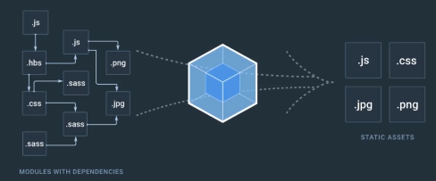

# 一、起步


- 学习react 基本语法
- 熟悉官方create-react-app脚手架
- 掌握JSX语法
- 掌握setState
- 掌握react声明周期
- 掌握props传递参数
- 掌握react组件通信


官方网站:  https://reactjs.org/


https://github.com/search?q=create-react-app


## 1、上手

- 全局安装官方脚手架

  ```
  npm install -g create-react-app   // -g 是全局安装的意思
  ```

- 初始化

  ```
  cd 工程目录
  create-react-app react_01
  ```

- react的Api比较少, 基本学一次就不再看文档了, 核心是JS的功力

  

  

  


# webpack 疑问? 


1、浏览器不能直接运行jsx, 为什么用了webpack就可以了呢? 

2、我们为什么能在js里面require图片、css 这些非js内容呢? 

3、为什么我们能够在不刷新页面的情况下展示刚刚修改的代码呢? 

4、我们如何操作能让正式上线的代码优化到极致呢? 

5、如何配合webpack调试React的服务端渲染呢? 

以上这些都是webpack给我们带来的疑问?  


毫无疑问webpack 作为一个大包工具是出色的, 下面就让我们来了解下webpack

 

如上图所示, webpack 可以将我们开发时离散的开发资源,拼凑打包成一个更适合我们 线上项目运行时的静态资源.  中间就是webpack在帮我们处理. 


在后面我们会一一介绍:

-  `webpcak的配置` 
- `搭建项目的过程`  
- `了解前端工程的意义` 

可能你会说, 我只想学react, 但是在现在的前端市场, 前端工程已经是一个逃不开的问题. 用react写页面逻辑只是一个基本功. 但是难的是把一个项目组织起来. 从开发到上线流程, 这是一个高级工程师必备的技能. 


1、你会使用React的服务端渲染吗? 

在使用React框架以后, 我们所有的HTML内容都是通过JS在浏览器中进行生成的.  也就是说我们在浏览器中输入一个URL. 得到的是一个没有任何内容的HTML, 要等这个HTML中引用的javaScript代码加载完成之后,才能渲染出HTML显示的内容. 这样用户才能看到.  这样就带来了几个问题:

- 第一、SEO不友好.
  - 因为SEO需要去解析URL返回的HTML文档中的内容. 才去做HTML推广, 因为通过URL获取到的HTML中是没有任何内容的. 所以SEO根本抓不到网页中的任何东西. 
- 第二、首屏时间较长, 用户体验差.
  - 因为我们要去等所有的javaScript加载完成之后采取渲染HTML的内容, 这种情况下是要比我们直接加载有内容的HTML是要长很多的. 所以我们的首屏时间要较长些. 

于是,服务端渲染就此诞生了, 依旧是React作为先驱, 为我们带来了可以前后端同构的可能. 同时随着React框架使用的越来越多, 服务器端渲染的需求越来越大. 当然这里指的不是简单给你一个打包完成的App, 然后你调用React的Dom Server  然后就完了. 

我们的难点在于如何去配置, 能够打包出一个在服务器端渲染的的app.

既然我们要服务器端渲染, 我们肯定要考虑: **数据同步、路由跳转、 SEO信息.** 等问题. 这些问题如何去解决.

还有我们在开发时使用webpack deb server,根本在本地拿不到开发完成的app,我们如何在开发的时候方便的进行服务端渲染的测试? 总不能每写几句就打包出一个新的app 进行测试吧?  下面我们将从零开始配置我们的项目. 一步一步的去学习服务器端渲染的代码.  开发阶段和正式上线阶段不同环境的处理. 随着业务加深, 进一步掌握服务器端渲染的细节, 最终达到一个完整项目需要要完成服务端渲染的所有配置. 同时会教会你为什么可以这样配置,及一些原理性的内容. 让你充分理解服务器端渲染的细节. 以便于你在将来的时候自己搭建项目的时候根据自己的需求进行修改. 


大家在网上都能找到很多关于React的资料, 教程,分享之类的文章. 也有一些最佳实践之类的项目等等. 但是这些都是在说React如何去写一个组件, 或者扔给你一堆代码, 给你说运行某个命令就能跑起来. 在一些公司里面也会出现这样的体验. 	 比如说: 我构建好了一个项目,然后给开发业务的同事说, 你按照我的规范去写组件就可以了. 因为在公司里面我们要以效率为主, 没有时间去等每一位同事都学会所有的知识. 这就导致了现在市场上有很多会写React Vue的同学, 但是大部分的人都不知道如何让一个项目跑起来.  如果你不知道项目是如何运转的,一旦遇到问题, 或者是新的需求你就很难去做修改.  


 下面我们就来学习一下如何从零去构建一个前端工程, 没有使用任何代码生成工具, 每一行代码都是自己敲出来的. 希望由此,让大家由浅入深的学习前端工程.  以目前最流行的前端架构工具 webpack作为基础,建立知识底蕴, 为自己将来的发展打好地基.


后面我们主要学会以下几点内容:

- 工程架构的概念, 为什么我们要做架构
- 服务端渲染的难点以及如何解决
- React + React-Router + Mobx的项目架构模式


> 适合人群:
>
> - 希望进阶学习前端
> - 能够就掌控整个项目的同学
> - 希望学习一个完整React应用如何泡起来的同学


> 学习准备:
>
> - ES6基础
> - React基础用法, 最好有一些项目经验
> - 基本的Node.js知识
> - 基本的webpack知识


# 二、工程架构

## 1、webpack 配置


### 1、WebPack 介绍

webpack is  a module bundler for modern JavaScript applications.

这是webpack 官方给的介绍. 一个为现代JS应用诞生的模块打包器. 但, 其实webpack 不仅仅用来打包JS、CSS、图片、字体、甚至是你自己发明的东西都可以用webpack来打包.  我们前端的所有资源都可以使用webpack来打包.  

webpack 打包的核心是有一个laoder机制, webpack通过一个loader去处理你指定的资源某个资源,比如javaScript代码、CSS文件等, 这些loader处理好这些资源文件后会将这些资源文件(比如: javaScript代码, 如果你是用ES6来写的, 他会将它处理成ES5, 浏览器能执行的代码.)最终经过webpack的处理生成一个完整的JavaScript文件. 

所以说, 如果你发现你使用的某种资源文件,但是你没有找到对应的loader, 你甚至可以自己写一个webpack的loader来处理自己的文件. 


###2、Webpack基础配置


#### 1、初始化项目

```
npm init  // 一顿回车
```

命令执行完成后会在当前项目生成一个`package.json` 文件,详细内容如下:

```
{
  "name": "demo_01",
  "version": "1.0.0",
  "description": "webpack 学习入门 01",
  "main": "index.js",
  "scripts": {
    "test": "echo \"Error: no test specified\" && exit 1"
  },
  "author": "tom",
  "license": "ISC"
}
```


####2、使用 npm 安装 webpack

```
npm install webpack  // 本地安装
```


#### 3、使用npm 安装 react

```
npm install react  // 本地安装
```


#### 4、配置项目目录

- 在当前目录下新建一个 build目录

  - 在这个目录下, 我们会放一些配置文件,一些webpack的config文件, 以及在工程中会用到的一些脚本文件. 
  - 在build目录下我们再新建一个 webpack.config.js
    - 在webpack.config.js 中我们主要做一些

- 在当前目录下新建一个 client 目录

  - 这个目录主要放我们前端的应用的软件
  - 在client目录中, 我们再新建一个 app.js文件和 App.jsx文件
    - app.js 文件作为我们应用的入口文件, 把它mount到我们的html里面
    - App.jsx文件主要做的就是声明我们整个页面的内容

  

####5、编写webpack.config.js 配置文件

```
const path = require('path')
 
module.exports = { 
    entry : {
        app : path.join(__dirname, '../client/app.js')	// webpack打包入口文件
    }, 
    output : { 
        filename: '[name].[hash].js',    // 打包输出文件名 app名+hash
        path: path.join(__dirname, '../dist'), 	// 打包输出路径
        publicPath : '/public'	// 静态文件路径
    }
}
```

编写webpack.config.js文件主要工作有几点

- `entry` : 说明webpack打包app的入口文件是什么
- `output`: 说明webpack打包后的输出文件路径是什么, 输出文件名是什么, 静态资源路径是什么


#### 6、添加 build脚本

- 在 package.json 文件中添加 build 脚本, 使用webpack 打包app 

  ```
  "scripts": {
      "test": "echo \"Error: no test specified\" && exit 1",
      "build": "webpack --config build/webpack.config.js"  // 在scripts标签中增加这个配置即可
    }
  ```

  - 配置了build 脚本后, 执行命令`npm run build` 即可打包

> 更详细的说明看demo:  `01.Webpack基础配置 `


### 3、Webpack loader基础应用


####1、在App.jsx文件中编写 react 组件

在jsx 文件中编写react 组件主要有几步:

1、引入react模块, 这个模块是我们编写react的基础,必须导入

> 如果当前项目中没有安装react 可以使用命令 `npm install react` 安装

2、继承React中的Component 模块, 编写class. 

​	其实我们写React组件就是写class, 这些class 都是继承自 `React.Component` 

3、在class中定义 render函数,  React 组件里面必须要有render函数. 

​	render函数的返回值就是我们的React组件在渲染时, 要生成一个什么样的HTML代码. 因此在定义render方法时,直接返回我们想要的HTML就可以了, 不过在返回是 HTML代码要使用小括号`()` 包裹 

> 注意:
>
> 我们在编写JSX代码的时候需要配置好我们的编辑器, 因为JSX里面的代码是 JS代码和HTML代码混合的, 编辑器会报错, 直接安装对应的插件即可,
>
> webstorm 默认情况下是支持JSX语法的, 所以使用webstorm编辑器不用安装格外的插件


App.jsx 中的代码如下:

```
import  React from 'react'
export default class App extends  React.Component {
    render (){
        return (
            <div> this is app </div>
        )
    }
}
```


####2、编写app.js代码

1、引入react-dom 模块 ReactDOM

```
import ReactDOM  from 'react-dom'
```

> react-dom 模块是将我们的React组件渲染到DOM里面的
>
> 从react-dom 这个名字, 我们可以猜想到 有 react-native 这样的模块, 使用react-native可以将React组件渲染到iOS app 或者 android app 里面运行

2、 引入 App.jsx 中编写的 React 组件App

```
import App from './App.jsx'
```

> 注意:
>
> 在此处我们引入 `App.jsx` 文件是需要带后缀`.jsx` 的, 因为我们还没有配置忽略后缀的功能, 后面我们配置了忽略后缀后, 在整个工程项目中, 我们在引入某些项目文件时就可以省略文件后缀名, 只需要在引入文件时提供文件的名称即可, 这一点需要注意一下. 

3、让ReactDOM 执行render方法, 将组件App挂载到页面上某个标签上

```
ReactDOM.render(App, document.body);
```

> 我们这里直接将组件挂载到body节点下, 其实React官方是不推荐之间挂载到body标签上的, 推荐挂载到body里面的其它标签上


app.js 代码如下: 

```
import ReactDOM  from 'react-dom' 
import App from './App.jsx'
ReactDOM.render(App, document.body);
```


#### 3 、配置webpack 识别React代码 (即识别 JSX代码)(添加loader)

因为我们的React代码不是标准的javaScript 代码 (jsx代码), webpack默认的情况下是不识别的, 因此我们要在`webpack.config.js` 文件中对webpack进行配置, 让webpack支持是被React代码(即让webpack 识别jsx代码). 

- 在webpack.config.js中增加一个 module, 在module 中增加一个 rules, rules对应的是一个数组, 在rules对应的这个数组中我们可以配置很多的loader, 每个loader 都可以解决对应的问题.

  - 新增的module配置如下:

    ```
    module :{
      rules : [
              { 
                test: /.jsx$/ , 
                loader: 'babel-loader'
              }
      ]
    }
    ```

    > - `rules`  对应的是一个数组,说明有哪些loader.具体 loader的描述信息使用`{}` 说明, 比如: 使用什么loader, 处理哪些哪类文件.
    >   - `loader`: 用于指定loader的名字(即使用哪个loader), 比如: 此处使用的是`babel-loader`
    >   - `test` :   就是说明loader要处理哪个 、哪些文件. 比如: 此处使用正则`/.jsx$` 表示使用`babel-loader` 处理使用的 `.jsx` 文件
>
    > 其实依据话, rules 就是用来配置loader的, 说明有哪些loader, 每个loader处理哪些问题, 就这么简单

  


  > webpack.config.js 的详细内容如下:

  ```
  const path = require('path')
  
  module.exports = { 
  		// webpack 的入口
      entry : {
          app : path.join(__dirname, '../client/app.js')
      },
   
   		// webpack 的输出
      output : { 
          filename: '[name].[hash].js', 
          path: path.join(__dirname, '../dist'), 
          publicPath : '/public'
      }, 
      
      // webpack 的配置信息 (load描述信息)
      module :{
          rules : [
              { 
                  test: /.jsx$/ , 
                  loader: 'babel-loader'
              }
          ]
    } 
  }
  ```


##### 1、babel 介绍

babel 是一个能够编译各种最新JS语法的工具, 它编译出来的是浏览器默认可以执行的ES5的语法. babel可以编译非常多, 比如: ES6、ES7、 ES8 等等 最新的ES语法都可以编译. 然后它也支持JSX的编译, 现在React默认的官方编译工具就是使用babel进行编译的.


####4、安装配置babel-loader 编译JSX

- 安装`babel-loader` 

  ```
  npm install babel-loader@7.1.5 -D // -D 表示的是开发依赖安装
  
  // babel-loader@7.1.5 表示安装指定版本的babe-loader
  ```

  > 经过测试发现, 使用`npm install babel-loader -D `安装的babel-loader版本要高些编译JSX时要报错, 因此,此处选择安装指定版本的babel-loader, 解决编译问题 

- 配置bable-loader 支持编译 JSX **(默认只能编译ES6为ES5, 不能编译jsx)**     

  - 在项目的根目录下新建一个`.babelrc` 文件,说明当前项目使用的javaScript的版本及说明当前项目中安装的babel-loader要用来编译JSX, 具体配置及说明内容如下:

  ```
  {
  	// presets 代表babel支持的语法, 因为现在javaScript的版本非常的多,eg: ES5、ES6、ES7 JSX 等等. babel 默认情况下把这些版本拆分出去了. 在babel-core里面是没有指定具体版本的. 
  	
  	"presets" : [
		["es2015", {"loose": true}], // 指定我们现在写的javaScript语言的版本
  		"react"			// 说明当前babel可以编译react的代码
	]
  }
  ```
  
  > - `presets` : 对应的是一个数组, 里面可以有很多的说明项, 在这个presets里面我们可以告诉babel, 我们在项目里使用的是那个版本的JS语言, 以及我们希望babel具备哪些功能
  >
  >   因为现在javaScript的版本非常的多,eg: ES5、ES6、ES7 JSX 等等. babel 默认情况下把这些版本拆分出去了. 在babel-core里面是没有指定具体版本的. 如果不说明清除,babel是不知道我们使用的是那个版本的JS在写代码, 无法准确的帮助我们编译对应的JS代码
  >
  >   - `["es2015", {loose:true}]` : 表示告诉babel我们项目采用的是 es5的松散语法
  >   - `"react"` :  添加这一项表示告诉babel我们需要编译react的代码
  

有了上面对`.babelrc` 文件对babel 的配置后还不够, 因为babel-loader只是babel的一个插件, 还需要安装`babel-core` (babel的核心)

```
  npm install babel-core -D // -D 表示的是开发环境依赖
```

- 除了安装 babel-core, 还不够, 还要安装下面几个babel的插件:  `babel-preset-es2015`  `babel-preset-es2015-loose`  `babel-preset-react` , 安装完成后才能使用babel-loader编译JSX
  
  ```
  npm install babel-core babel-preset-es2015 babel-preset-es2015-loose babel-preset-react -D
  ```
  


**提示:** 

到目前为止, 我们整个React项目的基本配置已经完成了, 我们已经可以使用webpack将我们的React代码(即, jsx代码) 编译成ES5的javaScript代码了. 我们使用命令`npm run build` 是没问题的了. 

但是, 但是, 现在我们依然不能在浏览器上打开我们的代码, 我们还需要完成下面的步骤: 安装 **html-webpack-plugin 插件**


####5、安装 html-webpack-plugin 插件


- 安装 html-webpack-plugin 插件

  ```
  npm install html-webpack-plugin -D // 因为是开发依赖, 任然要使用 -D 安装
  ```

- 在webpack.config.js文件中配置plugins插件

  - 在webpack.config.js文件中导入`html-webpack-plugin`插件

    ```
    const HTMLPlugin = require("html-webpack-plugin");
    ```

  - 在webpack.config.js 文件中增加 plugins 字段, 描述所有的插件

    - plugins 对应的是一个数组, 里面可以有很多的插件

    ```
    plugins : [
    	new HTMLPlugin()
    ]
    ```

- 配置完成后的webpack.config.js 文件内容如下:

  ```
  const path = require('path') 
  const HTMLPlugin = require('html-webpack-plugin')
  
  module.exports = {
  
      // 配置 webpack 入口文件信息
      entry : {
          app : path.join(__dirname, '../client/app.js')
      }, 
      // 2. 配置 webpack打包 输出信息
      output : { 
          filename: '[name].[hash].js', 
          path: path.join(__dirname, '../dist'), 
          publicPath : '/public'
      },
   
      // 配置各种loader
      module :{
          rules : [
              {
                  // 正则匹配所有的jsx文件
                  test: /.jsx$/ , 
                  loader: 'babel-loader'
              }
          ]
      },
  
      // 配置各种插件
      plugins : [
          new HTMLPlugin()
      ] 
  }
  
  
  ```

   

- html-webpack-plugin 插件使用的总结

  我们编写的react代码(jsx 代码) 经过webpack 打包后直接输出的是一个 `.js` 文件, 不能直接在浏览器上运行, 我们借助`html-webpack-plugin` 插件, 可以将webpack打包生成的`.js` 代码生成`.html` 文件, 同时它会将webpack.config.js文件里面的`entry` 注入到里面. 且文件的路径也根据`webpack.config.js` 里面 的`output` 配置拼接起来的

     

  从上图我们可以看到, 在index.html文件中就通过 script标签引用了我们webpack打包生成的app . 通过 html-webpack-plugin 插件, 可以将经过webpack打包的js文件了, 但是, 因为我们现在没有写任何服务器,也没有做任何路径的映射, 所以我们直接打开HTML文件是不能访问到里面js文件内容的

 

#### 6、不启用本地服务,直接使用chrome打开 index.html 文件(坑多)

- 1、当我们直接在webstorm中直接使用`Chrome` 打开webpack 为我们生成的`index.html`后,  我们会发现在`index.html` 中引入的`app.03c7f44996b46ae3eb17.js` 文件无法加载,如下图:

   

  经过分析, 我们发现是因为我们在webpack.config.js的outpu配置项中, 配置了`publicPath: '/public'` , 导致生成的index.html中script标签在引入js文件时, 文件路径前有`/public` , 因为我们没有启动本地server服务, 自然直接打开index.html 时加载`.js` 文件失败.  

- 2、为了直接打开index.html文件能正常加载`.js` 文件, 我们重新配置的 `webpack.config.js` 文件,配置 `publicPath: ''` ,如下: 

  ```
  const path = require('path')
  const HTMLPlugin = require('html-webpack-plugin')
  module.exports = {
      entry : {
          app : path.join(__dirname, '../client/app.js')
      },
      output : {
          filename: '[name].[hash].js',
          path: path.join(__dirname, '../dist'),
          publicPath : ''
      },
      module :{
          rules : [
              {
                  test: /.jsx$/ ,
                  loader: 'babel-loader'
              }
          ]
      },
      plugins : [
          new HTMLPlugin()
      ]
  }
  ```

  修改了, 我们发现依然不能直接运行`index.html` 文件, 后面我们又经过分析, 发现是我们在编写`app.js`时,出了问题, 我们在调用 `ReactDOM.render` 函数时也要按照JSX的语法书写, 且在文件的最前面也需要导入`react` 模块, 正确的书写代码如下:

  

- 3、修改 app.js 文件

  ```
  import  React from 'react'        // 导入react模块
  import ReactDOM  from 'react-dom'	// 导入react-dom模块,将react组件渲染到DOM里
   
  import App from './App.jsx'	// 导入我们自己写的react组件 App
   
  ReactDOM.render(<App /> , document.body);	// 调用ReactDOM.render 方法时, react组件 App 需要按照jsx语法书写使用 '< />' 包裹
  ```

- 4、让webpack中的babel-loader能够将`app.js` 也按照jsx语法编译

  我们为什么要让`babel-loader` 将`app.js` 文件按照JSX的语法编译呢? 

  是这样的,我们在`app.js` 文件中调用了`ReactDOM.render` 函数, render函数 使用了JSX语法, 因此我们需要使用babel-loader 编译它. 

  - 为了让 babel-loader能够编译 `app.js` 文件, 我们在webpack.config.js中需要额外的配置, 其配置方式有2种:

    - 一种是, 明确的指定babel-loader, 要将`app.js` 这个文件编译(这种做法不推荐), 具体做法如下:

      ```
      const path = require('path') 
      const HTMLPlugin = require('html-webpack-plugin')
       
      module.exports = { 
          entry : {
              app : path.join(__dirname, '../client/app.js')
          },
          output : { 
              filename: '[name].[hash].js', 
              path: path.join(__dirname, '../dist'), 
              publicPath : ''
          }, 
          module :{
              rules : [
                  { 
                      test: /.jsx$/ , 
                      loader: 'babel-loader'
                  }
                  ,
                  {  
                      test: /app.js$/,   //明确要匹配app.js文件
                      loader: 'babel-loader'  
                   }
              ]
          }, 
          plugins : [
              new HTMLPlugin()
          ] 
      }
      ```

    - 在配置babel-loader的时候, 指定匹配的类型,排除不匹配的文件路径**(推荐)**

      >  包含一部分,排除一部分

      ```
      const path = require('path')
      const HTMLPlugin = require('html-webpack-plugin')
      
      module.exports = {
          entry : {
              app : path.join(__dirname, '../client/app.js')
          },
      
          output : {
              filename: '[name].[hash].js',
              path: path.join(__dirname, '../dist'),
              publicPath : ''
          },
      
          module :{
              rules : [
                  { 
                      test: /.jsx$/ ,   // 所有的 .jsx 文件按照react编译
                      loader: 'babel-loader'
                  }
                  ,
                  {
                      test: /.js$/ , // 所有的除了 exclude 目录下的 .js文件按照react语法编译
                      loader: 'babel-loader',
                      exclude : [
                           path.join(__dirname, '../node_modules')
                      ]
                  }
              ]
          },
      
          // 配置各种插件
          plugins : [
              new HTMLPlugin()
          ] 
      }
      
      
      ```

      


>  到此, webpack load 基础应用的配置就完了, index.html 文件可以直接运行打开了
>
>  更详细的说明看demo:  `02.Webpack loader基础应用` 


## 2、服务端渲染


###1、服务器端渲染介绍


#### 1、为什么会有服务器端渲染呢?

其一, 在现在的webapp开发模式下, 我们用的很多前端开发框架, 都是在浏览器端渲染出前端内容. 这样直接就导致了一个问题: **"SEO不友好"**  .   SEO不友好的原因是这样的,像**百度、Google**这些抓取引擎,它们在抓取网站内容的时候是不会去执行 JS 代码的. 所以根据我们网站的url去抓取到的网页内容实际上是一个空白HTML. 这样抓取工具就会判定这个网站没有内容.  这就是直接导致SEO不友好原因. SEO不友好就直接导致我们网站的内容无法在搜索引擎上被用户搜索到, 无法进行网站推广.  

其二, 因为是浏览器前端渲染, 必须要等到所有的javaScript代码加载完成后, 才会在浏览器上显示内容, 这就导致首次请求等待时间较长(较长时间白屏), 用户体验不好.  


所以当是最火的前端框架react团队就发明了服务器端渲染.  也就是说我们使用react框架构建完成的webapp,  可以在node.js 环境下渲染然后得到能在浏览器上直接显示的HTML的内容. 这样的话,搜索引擎通过网站URL爬取的的内容就是能直接在浏览器上显示的HTML网页,就解决了SEO不友好的问题, 其次, 浏览器通过URL访问呢网站后获取到的是可以直接显示的HTML网页内容, 首屏加载时间也缩短了, 用户体验也得到的提高. 这就是为什么会有服务器端渲染. 


#### 2、react中如何使用服务器端渲染

react-dom 是react团队专门为web端开发的一个渲染工具. 我们可以在客户端使用react-dom中的render方法渲染React组件成HTML. 也可以在服务端中使用 react-dom/server模块中的renderToString方法 将React组件渲染成HTML. 


### 2、服务端渲染配置


服务端渲染配置的思路是这样的.

1、创建一个js文件(client/server_entry.js)将 React组件`<App/>` 导出. 

2、虽然第一步我们使用server_entry.js将 React组件`<App/>` 组件导出来了, 但是导出的仍然是**JSX**  的语法, 在服务端的node换将下是不识别**JSX** 语法的, 因此我们需要新创建一个webpack的配置文件`webpack.config.server.js` , 这个配置文件的功能就是将 **JSX**  通过webpack打包导出一个**JS** 语法规则的`server_entry.js` 文件. 

3、

 

####1、在client目录下创建`server_entry.js` 文件,导出 React组件 `<App/>` 

```
import React from 'react'   // 因为我们后边要使用到 JSX 的语法, 所以必须要导入 react
import App from './App.jsx'

export default  <App />


// 我们为甚要要直接 将 <App /> 导出呢?
// 是因为我们在服务端渲染的时候要使用它,
// 且,JSX的代码是不能直接在服务端node环境中使用
// 所以我们要自己编写一个js代码来包装 JSX 代码
// 这样 webpack 就会将js中的JSX代码编译出, 生成最终的js代, node环境的服务端的就可以使用了


// 为了让webpack 将我们写的 server_entry.js 代码也打包出来
// 因此我们要再建一个 webpack.config.server.js 配置文件, 来配置我们的webpack
```


####2、在build 目录下创建配置`webpack.config.server.js` 文件,打包输出`serve_entry.js` 文件

```
const path = require('path')

// 导出一个webpack配置对象
module.exports = { 
     target: 'node', // 指定当前webpack输出文件用在node.js 环境
     entry : {
            app : path.join(__dirname, '../client/server_entry.js')
     },
     output : {
            // 因为我们后面要手动 import 这个文件, 所以名字最好固定, 不能动态生成
            filename: 'server_entry.js',  
            path: path.join(__dirname, '../dist'),
            publicPath : '/public', 
            libraryTarget: 'commonjs2' // 使用最新的commonjs的方案
        },

        // 因为JSX是HTML和JS的混合, 默认webpack 是不认识的. 我们要配置一下loader来解析
        // 配置各种loader
        module :{
            rules : [
                {
                    test: /.jsx$/ ,
                    loader: 'babel-loader'
                }
                ,
                {   test: /.js$/ ,
                    loader: 'babel-loader',
                    exclude : [
                        path.join(__dirname, '../node_modules')
                    ]
                }
            ]
        }
}


```

- `target` 项的作用是:
  - 在webpack 中有一个配置项, 就是说 用于说明webpack打包出来的内容用在哪种环境下,这里配置 target = node  是告诉webpack, 打包出来的内容是用的node.js环境下的. target 对应的取值可以是 `web`  表示在浏览器环境上使用, 也可以是`node`表示在node.js 上使用, 当然还有其它的取值...可以查看webpack 文档
- `libraryTarget` 项作用是:
  - 使用libraryTarget指定打包出去的js的方案, eg:  umd, cmd, amd, commonjs, global 等


####3、在client目录下创建 `template.html`  文件 (html模板文件)

```
<!DOCTYPE html>
<html lang="en">
<head>
    <meta charset="UTF-8">
    <title>我 是 标 题</title>
</head>
<body>
<div id="root">
    <app></app>
</div>

</body>
</html>
```


####4、配置webpack.config.client.js 文件,webpack 客户端打包输出

```
// (在js中使用相对路径有时会出问题, 因此尽量使用绝对路径)
// 引入node 中的 path模块, 后面使用绝对路径防止路径错误
const path = require('path')

// 引入 html-webpack-plugin 将js 代码转为html
const HTMLPlugin = require('html-webpack-plugin')


// 导出一个webpack配置对象
module.exports = {

    // 1. 指定webpack 打包的入口
    // entry 就是告诉webpack , app 是打包的一个入口, 然后根据app里面的依赖关系一层一层的迭代下去形成一个依赖树, 然后把所有的依赖文件打包成一个js文件
    entry : {
        app : path.join(__dirname, '../client/app.js')
    },


    // 2. 说明webpack打包的输出
    output : {
        // 2.1 指定输出文件名
        // 指定文件的输出名, 可以是一个固定的名字,比如: app.js, 也可以动态生成(建议)
        // []表示的是变量 , output 里面有那些变量呢? 一个是name 代表entry中一项的名子就是 app  , 一个是hash 表示对整个app打包完后计算的哈希值, 这样的话, 一旦我们app依赖树里面任何一个文件改变了,哈希值就变化了, 这样我们在网站上引用输出文件名就变化了, 浏览器就会自动刷新缓存跟新页面
        // [name] 表示的entry 中第一项的名字就是 app
        // [hash] 表示整个app打包后计算出的哈希值
        filename: '[name].[hash].js',

        // 2.2 指定输出文件路径 (放在根目录下的dist 目录中)
        path: path.join(__dirname, '../dist'),

        // 2.3 指定静态资源引用的路径
        // 生成的路径是 /public/app.hash.js
        publicPath : '/public'
    },

    // 因为JSX是HTML和JS的混合, 默认webpack 是不认识的. 我们要配置一下loader来解析
    // 配置各种loader
    module :{
        rules : [
            {
                // 正则, 所有的以 .jsx结尾的文件
                test: /.jsx$/ ,
                // babel可以编译我们的jsx 语法的工具, 编译出来的是浏览器可以执行的ES5语法
                // babel 可以编译很多, 比如: ES6 ES7 ,现在官方的react 使用的JSX编译工具就是babel
                // 因为我们在开发环境才会用到 babel-loader, 因此使用 npm install babel-loader -D 安装到开发时依赖
                // 因为 babel-loader 只是babel-core的一个插件, 因此我们还需要安装 babel-core, npm install babel-core -D
                loader: 'babel-loader'
            }
            ,
            {   // 配置 当前项目下所有的 .js 文件按照 jsx语法让babel处理, 除了  node_modules 目录
                test: /.js$/ ,
                loader: 'babel-loader',
                exclude : [
                    path.join(__dirname, '../node_modules')
                ]
            }
        ]
    },

    // 配置各种插件
    plugins : [
    		// HTMLPlugin 可以没有参数, 表示使用默认的空白html文件
    		// 有参数, 表示使用指定的html模板文件
        new HTMLPlugin({
            // 以'../client/template.html' 目录下的html为模板, 插入js
            template: path.join(__dirname, '../client/template.html')
        })
    ]
}
```


####5、配置package.json 文件

添加对应的脚本, 编译客户端和服务端

```
{
  "name": "demo_01",
  "version": "1.0.0",
  "description": "webpack 学习入门 01",
  "main": "index.js",
  "scripts": { // 配置 npm 脚本
  	// 客户端 webpack 脚本
    "build:client": "webpack --config build/webpack.config.client.js",
    // 服务端 webpack 脚本
    "build:server": "webpack --config build/webpack.config.server.js", 
    // 删除 dist 目录的脚本
    "clear": "rimraf dist",  // 
    // 编译脚本
    "build": "npm run clear && npm run build:client &&  npm run build:server",
    // 服务端渲染的脚本
    "start": "node ./server/server.js"
  },
  "author": "tom",
  "license": "ISC",
  "dependencies": {
    "express": "^4.17.1",
    "react": "^16.12.0",
    "react-dom": "^16.12.0",
    "webpack": "^4.41.5"
  },
  "devDependencies": {
    "babel-core": "^6.26.3",
    "babel-loader": "^7.1.5",
    "babel-preset-es2015": "^6.24.1",
    "babel-preset-es2015-loose": "^8.0.0",
    "babel-preset-react": "^6.24.1",
    "cross-env": "^7.0.0",
    "html-webpack-plugin": "^3.2.0",
    "rimraf": "^3.0.0", //  rimraf 是npm 中的一个小插件, 用于删除文件夹
    "webpack-cli": "^3.3.10",
    "webpack-dev-server": "^3.10.1"
  }
}

```


####6、创建server.js 服务端渲染, 替换 index.html 中的`<app> </app>` 

```

const express = require('express')
// 导出 react-dom 下的server 服务端渲染
const ReactSSR = require('react-dom/server')
const fs = require('fs')
const path = require('path')


// 因为server_entry.js中使用的是 commonjs2的规范, 直接require后的内容如下:
/*
 { __esModule: true,
 default:
 { '$$typeof': Symbol(react.element),
 type: [Function: t],
 key: null,
 ref: null,
 props: {},
 _owner: null } }
*/
// 在node中我们需要使用default 对应的内容
const serverEntry = require('../dist/server_entry.js').default
const template = fs.readFileSync(path.join(__dirname, '../dist/index.html'), 'utf8')

const app = express()

// 处理所有的静态文件请求
app.use('/public', express.static(path.join(__dirname, '../dist')))

// 启动服务
app.get('*', function(req, res){
    const appString = ReactSSR.renderToString(serverEntry)
    console.log('===', appString, '===')
    console.log('===', template, '===')

    // 使用react 组件 替换 <app> </app>
    res.send (template.replace('<app> </app>', appString));
})

// 监听端口
app.listen(3333, function () {
    console.log('服务端 渲染 server 启动 ok, 端口 3333')
})
```


##3、webapp项目开发常用配置


webpack 项目开发的常用配置

在我们项目开发的时候, 我们使用webapp的开发模式, 因为前段的代码改动会非常的多, 如果按照以前, 每次改动后我们都先 `npm run build`  再 `npm run start` 的话, 项目开发中就会非常的麻烦. 浪费我们非常多的时间,  在这里我们有许多很好用的工具, 可以提高我们的开发效率.  

第一个是`webpack dev server`, `webpack dev server`  是webpack 官方提供给我们的插件, 这个插件能让我们通过webpac的配置去启动一个服务器. 这个服务器的内容是存在于内存中的. 每次我们前端的文件发生变化, 他都会自动的去执行编译, 这样的话我们就不需要每次都手动的去执行 build 和 start了. 


第二个是`Hot module replacement` 


# 三、 项目架构


## 1、React


## 2、React-Router 配置


## 3、Mobx配置


## 4、服务端渲染优化


# 四、业务开发


## 1、页面开发


## 2、登陆服务


## 3、服务端渲染优化


# 五、项目部署


## 1、PM2


## 2、Nginx


## 3、一键部署

 


# 六、单页应用

## 特征

- 所有内容都在前端生成
- JS承担更多的业务逻辑, 后端只提供API
- 页面路由跳转不需要经过后端, 全部前端处理. 


## 常用类库

- React
- Vue
- Angular


## 架构工具

- npm
- bower
- jspm


## 模块化工具

- webpack
  - 官网: https://webpack.org 
- rollup
- browserify
- 